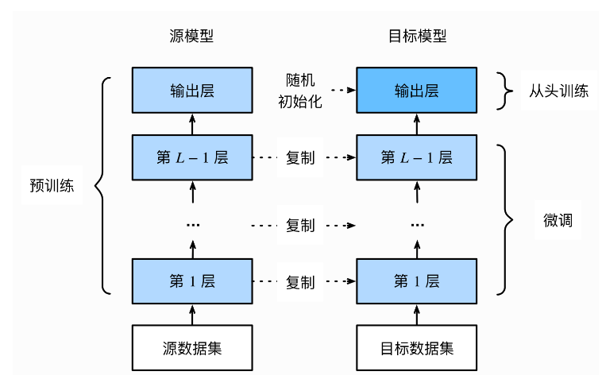

# PyTorch进阶训练技巧

## 1. 自定义损失函数
## 2. 动态调整学习率
## 3. 模型微调
## 4. 半精度学习


```python
import torch
import numpy as np
import torch.nn as nn
import torch.nn.functional as F
```

## 1. 自定义损失函数


```python
# 以函数的方式定义损失函数,通过输出值和目标值进行计算，返回损失值
def my_loss(output,target):
    loss = torch.mean((output - target)**2)
    return loss
```


```python
y_pred = torch.tensor(np.array([[0.2, 0.5], [0.3, 0.1], [0.9, 0.6]]))
y = torch.tensor(np.array([[0, 1], [1, 0], [0, 1]]))
print('loss为：',my_loss(y_pred,y))
```

    loss为： tensor(0.2933, dtype=torch.float64)
    


```python
# 以类方式定义：通过继承nn.Module，将其当作神经网络的一层来看待。
# 以DiceLoss损失函数为列子
class DiceLoss(nn.Module):
    def __init__(self, weight=None, size_average=True):
        super(DiceLoss,self).__init__()
        
    def forward(self, inputs, targets, smooth=1):
        inputs = F.sigmoid(inputs)
        # 将输入和输出转化为一维
        inputs = inputs.view(-1)
        targets = targets.view(-1)
        # 实现点成的效果
        intersection = (inputs * targets).sum()                   
        dice = (2.*intersection + smooth)/(inputs.sum() + targets.sum() + smooth)  
        return 1 - dice

class IoULoss(nn.Module):
    def __init__(self, weight=None, size_average=True):
        super(IoULoss, self).__init__()

    def forward(self, inputs, targets, smooth=1):
        inputs = F.sigmoid(inputs)       
        inputs = inputs.view(-1)
        targets = targets.view(-1)
        intersection = (inputs * targets).sum()
        total = (inputs + targets).sum()
        union = total - intersection 
        
        IoU = (intersection + smooth)/(union + smooth)
                
        return 1 - IoU


ALPHA = 0.8
GAMMA = 2

class FocalLoss(nn.Module):
    def __init__(self, weight=None, size_average=True):
        super(FocalLoss, self).__init__()

    def forward(self, inputs, targets, alpha=ALPHA, gamma=GAMMA, smooth=1):
        inputs = F.sigmoid(inputs)       
        inputs = inputs.view(-1)
        targets = targets.view(-1)
        BCE = F.binary_cross_entropy(inputs, targets, reduction='mean')
        BCE_EXP = torch.exp(-BCE)
        focal_loss = alpha * (1-BCE_EXP)**gamma * BCE
                       
        return focal_loss
```


```python
D_loss = DiceLoss()
I_loss = IoULoss()
F_loss = FocalLoss()
y_pred = torch.tensor(np.array([[0.2, 0.5], [0.3, 0.1], [0.9, 0.6]]))
y = torch.tensor(np.array([[0, 1], [1.0, 0.0], [0.0, 1.0]]))
print('D_loss为：',D_loss(y_pred,y))
print('I_loss为：',I_loss(y_pred,y))
print('F_loss为：',F_loss(y_pred,y))
```

    D_loss为： tensor(0.3858, dtype=torch.float64)
    I_loss为： tensor(0.5087, dtype=torch.float64)
    F_loss为： tensor(0.1459, dtype=torch.float64)
    

## 2. 动态调整学习率

- 学习率设置小了，会降低收敛速度，增加训练时间；
- 学习率设置大了，有可能导致在最优解两侧来回震荡；
- PyTorch中的scheduler，提供了解决问题的策略；

- PyTorch scheduler策略


* [lr_scheduler.LambdaLR](https://pytorch.org/docs/stable/generated/torch.optim.lr_scheduler.LambdaLR.html#torch.optim.lr_scheduler.LambdaLR)
* [lr_scheduler.MultiplicativeLR](https://pytorch.org/docs/stable/generated/torch.optim.lr_scheduler.MultiplicativeLR.html#torch.optim.lr_scheduler.MultiplicativeLR)
* [lr_scheduler.StepLR](https://pytorch.org/docs/stable/generated/torch.optim.lr_scheduler.StepLR.html#torch.optim.lr_scheduler.StepLR)
* [lr_scheduler.MultiStepLR](https://pytorch.org/docs/stable/generated/torch.optim.lr_scheduler.MultiStepLR.html#torch.optim.lr_scheduler.MultiStepLR)
* [lr_scheduler.ExponentialLR](https://pytorch.org/docs/stable/generated/torch.optim.lr_scheduler.ExponentialLR.html#torch.optim.lr_scheduler.ExponentialLR)
* [lr_scheduler.CosineAnnealingLR](https://pytorch.org/docs/stable/generated/torch.optim.lr_scheduler.CosineAnnealingLR.html#torch.optim.lr_scheduler.CosineAnnealingLR)
* [lr_scheduler.ReduceLROnPlateau](https://pytorch.org/docs/stable/generated/torch.optim.lr_scheduler.ReduceLROnPlateau.html#torch.optim.lr_scheduler.ReduceLROnPlateau)
* [lr_scheduler.CyclicLR](https://pytorch.org/docs/stable/generated/torch.optim.lr_scheduler.CyclicLR.html#torch.optim.lr_scheduler.CyclicLR)
* [lr_scheduler.OneCycleLR](https://pytorch.org/docs/stable/generated/torch.optim.lr_scheduler.OneCycleLR.html#torch.optim.lr_scheduler.OneCycleLR)
* [lr_scheduler.CosineAnnealingWarmRestarts](https://pytorch.org/docs/stable/generated/torch.optim.lr_scheduler.CosineAnnealingWarmRestarts.html#torch.optim.lr_scheduler.CosineAnnealingWarmRestarts)


**使用说明**：需要将`scheduler.step()`放在`optimizer.step()`后面

**1.使用官方API的动态调整学习率**：
```python
# 选择一种优化器
optimizer = torch.optim.Adam(...) 
# 选择上面提到的一种或多种动态调整学习率的方法
scheduler1 = torch.optim.lr_scheduler.... 
scheduler2 = torch.optim.lr_scheduler....
...
schedulern = torch.optim.lr_scheduler....
# 进行训练
for epoch in range(100):
    train(...)
    validate(...)
    optimizer.step()
    # 需要在优化器参数更新之后再动态调整学习率
	   scheduler1.step() 
	    ...
    schedulern.step()
```
**2.自定义scheduler**
```python
# adjust_learning_rate 自定义的学习率
def adjust_learning_rate(optimizer, epoch):
    lr = args.lr * (0.1 ** (epoch // 30))
    for param_group in optimizer.param_groups:
        param_group['lr'] = lr

optimizer = torch.optim.SGD(model.parameters(),lr = args.lr,momentum = 0.9)
for epoch in range(10):
    train(...)
    validate(...)
    adjust_learning_rate(optimizer,epoch)

```

# 3. 模型微调

 - 概念： 找一个同类训练好的模型，修改其输出层，冻结输出层之前的权重，训练输出层的参数；
 - 模型微调的流程：
 1. 在源数据集上训练神经网络模型，得到源模型；
 2. 创建一个新的神经网络模型，即目标模型，目标模型 = 源模型（结构+权重，结构不包括输出层）+ 新创建的输出层；
 3. 新创建的输出层，为目标数据集类别个数的输出层，并随机初始化新输出层的参数；
 4. 使用目标数据集训练目标模型




```python
# 冻结部分网络层
def set_parameter_requires_grad(model, feature_extracting):
    if feature_extracting:
        for param in model.parameters():
            param.requires_grad = False
            

import torchvision.models as models
# 冻结参数的梯度
feature_extract = True
model = models.resnet50(pretrained=True)
set_parameter_requires_grad(model, feature_extract)
print('原输出层：\n',model.fc)
model.fc = nn.Linear(in_features=512, out_features=4, bias=True)
print('现输出层：\n',model.fc)
```

    原输出层：
     Linear(in_features=2048, out_features=1000, bias=True)
    现输出层：
     Linear(in_features=512, out_features=4, bias=True)
    

## 4.半精度训练
- “半精度”：PyTorch默认的浮点数存储方式用的是`torch.float32`，其精度高，但是大数情况无需那么高，`torch.float16`的即可。


- 半精度训练的优点：减少显存占用，使得显卡可以同时加载更多数据进行计算。


- 设置半精度训练:
  1. 导入`torch.cuda.amp`的`autocast`包
    ```pyhton
    from torch.cuda.amp import autocast
    ```
  2. 在模型定义中的`forwar`d函数上，设置`autocast`装饰器
    ```pyhton
    @autocast()   
    def forward(self, x):
    ...
    return x
    ```
  3. 在训练过程中，在数据输入模型之后，添加`with autocast()`
  ```pyhton
   for x in train_loader:
	x = x.cuda()
	with autocast():
        output = model(x)
        ...
  
  ```

- 适用范围：适用于数据的size较大的数据集（比如3D图像、视频等）

# 总结
&ensp;&ensp;本次任务，主要介绍了Pytorch的进阶技巧：自定义损失函数、动态调整学习率、模型微调和半精度训练技巧。


 1. 自定义损失函数：函数方式和类方式，建议一般从输入到输出一直使用张量计算，不然过程会出现冲突错误；
 2. 动态调整学习率：相对小学习率提高了速度，相对大学习率避免了最优出横跳，yTorch中的scheduler动态调整学习率，也支持自定义scheduler；
 3. 模型微调：目标模型 = 源模型（结构(不包括输出层）和 参数）+ 新输出层，在新数据集上进行训练；
 4. 半精度训练主要适用于数据的size较大的数据集（比如3D图像、视频等）。

**注意**：在训练过程中，model仍会回传梯度，但是参数更新只会发生在`fc`层。

**参考**：

https://blog.csdn.net/weixin_44696221/article/details/104484355 

https://relph1119.github.io/my-team-learning/#/pytorch_learning35/task05

https://github.com/datawhalechina/thorough-pytorch/blob

