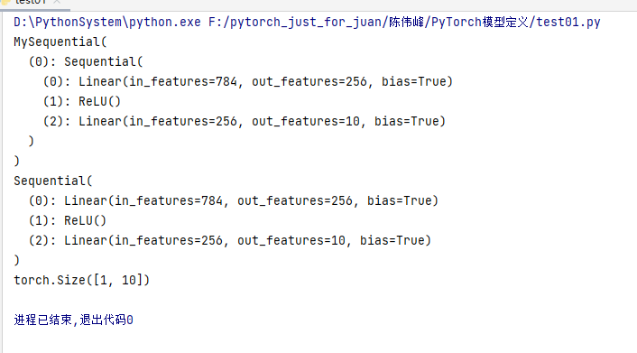

# 模型定义

## pytorch定义模型

#### 1.nn.Sequential()

1. key-value形式-字典形式

```python
import torch
from torch import nn
from collections import OrderedDict


class MySequential(nn.Module):
    def __init__(self, *args):
        super(MySequential, self).__init__()
        if len(args) == 1 and isinstance(args[0], OrderedDict): # 如果传入的是一个OrderedDict
            for key, module in args[0].items():
                self.add_module(key, module)  # add_module方法会将module添加进self._modules(一个OrderedDict)
        else:  # 传入的是一些Module
            for idx, module in enumerate(args):
                self.add_module(str(idx), module)
    def forward(self, x):
        # self._modules返回一个 OrderedDict，保证会按照成员添加时的顺序遍历成
        for module in self._modules.values():
            # self._modules.values 保存的是key-value
            print(module)
            x = module(x)
        return x


if __name__ == '__main__':
    args = OrderedDict([
                  ('conv1', nn.Conv2d(3,20,(5,5))),
                  ('relu1', nn.ReLU()),
                  ('conv2', nn.Conv2d(20,64,(5,5))),
                  ('relu2', nn.ReLU())
                ])
    model = MySequential(args)
    x = torch.randn(1,3,224,224)
    print(model)
    print(model(x).shape)

```


2. 直接排列式

```python
import torch
from torch import nn
from collections import OrderedDict


class MySequential(nn.Module):
    def __init__(self, *args):
        super(MySequential, self).__init__()
        if len(args) == 1 and isinstance(args[0], OrderedDict): # 如果传入的是一个OrderedDict
            for key, module in args[0].items():
                self.add_module(key, module)  # add_module方法会将module添加进self._modules(一个OrderedDict)
        else:  # 传入的是一些Module
            for idx, module in enumerate(args):
                self.add_module(str(idx), module)
    def forward(self, x):
        # self._modules返回一个 OrderedDict，保证会按照成员添加时的顺序遍历成
        for module in self._modules.values():
            # self._modules.values 保存的是key-value
            print(module)
            x = module(x)
        return x


if __name__ == '__main__':
    args = nn.Sequential(
        nn.Linear(784, 256),
        nn.ReLU(),
        nn.Linear(256, 10),
    )
    model = MySequential(args)
    x = torch.randn(1,784)
    print(model)
    print(model(x).shape)

```




#### 2. ModuleList

```python
import torch
from torch import nn


class model(nn.Module):
    def __init__(self, args):
        super(model, self).__init__()
        self.ModuleList = args

    def forward(self, x):
        for m in self.ModuleList:
            x = m(x)
        return x


if __name__ == '__main__':
    args = nn.ModuleList([
        nn.Linear(784, 256), nn.ReLU(),
        nn.Linear(256, 10)
    ])
    net = model(args)
    print(net)
    # net1(
    #   (modules): ModuleList(
    #     (0): Linear(in_features=10, out_features=10, bias=True)
    #     (1): Linear(in_features=10, out_features=10, bias=True)
    #   )
    # )

    for param in net.parameters():
        print(type(param.data), param.size())

    # class 'torch.Tensor'> torch.Size([256, 784])
    # class 'torch.Tensor'> torch.Size([256])
    # class 'torch.Tensor'> torch.Size([10, 256])
    # class 'torch.Tensor'> torch.Size([10])
    x = torch.randn(1,784)
    print(net)
    print(net(x).shape)
```


备注：ModuleList可以不受先后顺序制约，只是组合了模型

```python
import torch
from torch import nn


class model(nn.Module):
    def __init__(self, args):
        super(model, self).__init__()
        self.ModuleList = args

    def forward(self, x):
        for m in self.ModuleList:
            x = m(x)
        return x


if __name__ == '__main__':
    args = nn.ModuleList([
        nn.Linear(784, 256), nn.ReLU(),
        nn.Linear(256, 10)
    ])
    net = model(args)
    print(net.ModuleList[0])
    print(net.ModuleList[1])
    print(net.ModuleList[2])

    # 第一层定义
    x = torch.randn(1,784)
    print(net.ModuleList[0](x).shape)
    x  =torch.randn(1,256)
    print(net.ModuleList[2](x).shape)

    # net1(
    #   (modules): ModuleList(
    #     (0): Linear(in_features=10, out_features=10, bias=True)
    #     (1): Linear(in_features=10, out_features=10, bias=True)
    #   )
    # )


```


#### 3.ModuleDict

#### ModuleDict和ModuleList的作用类似，只是ModuleDict能够更方便地为神经网络的层添加名称。

```python
import torch
from torch import nn


class model(nn.Module):
    def __init__(self, args):
        super(model, self).__init__()
        self.ModuleDict = args

    def forward(self, x):
        for key,value in self.ModuleDict.items():
            print("当前层：",key)
            print("当前输出",value(x).shape)
            x = value(x)
        # for m in self.ModuleDict.values():
        #     x = m(x)
        return x


if __name__ == '__main__':
    args = nn.ModuleDict({
        'linear': nn.Linear(784, 256),
        'act': nn.ReLU()
    })
    args['output'] = nn.Linear(256, 10)
    # 添加

    net = model(args)
    x = torch.randn(1,784)
    print(net(x).shape)
```

#### 适用场景

Sequential适用于快速验证结果，因为已经明确了要用哪些层，直接写一下就好了，不需要同时写__init__和forward；

ModuleList和ModuleDict在某个完全相同的层需要重复出现多次时，非常方便实现，可以”一行顶多行“；

当我们需要之前层的信息的时候，比如 ResNets 中的残差计算，当前层的结果需要和之前层中的结果进行融合，一般使用 ModuleList/ModuleDict 比较方便。


精修某层，喜欢moudledict

快速实现，seq

仍以组合，list

参考resnet_fpn实现方式：

```python
from torchvision.ops import misc
import torch.nn as nn
import torch
from torch import Tensor
from collections import OrderedDict
import torch.nn.functional as F

from torch.jit.annotations import Tuple, List, Dict


class Bottleneck(nn.Module):
    expansion = 4

    def __init__(self, in_channel, out_channel, stride=1, downsample=None, norm_layer=None):
        super(Bottleneck, self).__init__()
        if norm_layer is None:
            norm_layer = nn.BatchNorm2d

        self.conv1 = nn.Conv2d(in_channels=in_channel, out_channels=out_channel,
                               kernel_size=1, stride=1, bias=False)  # squeeze channels
        self.bn1 = norm_layer(out_channel)
        # -----------------------------------------
        self.conv2 = nn.Conv2d(in_channels=out_channel, out_channels=out_channel,
                               kernel_size=3, stride=stride, bias=False, padding=1)
        self.bn2 = norm_layer(out_channel)
        # -----------------------------------------
        self.conv3 = nn.Conv2d(in_channels=out_channel, out_channels=out_channel * self.expansion,
                               kernel_size=1, stride=1, bias=False)  # unsqueeze channels
        self.bn3 = norm_layer(out_channel * self.expansion)
        self.relu = nn.ReLU(inplace=True)
        self.downsample = downsample

    def forward(self, x):
        identity = x
        if self.downsample is not None:
            identity = self.downsample(x)

        out = self.conv1(x)
        out = self.bn1(out)
        out = self.relu(out)

        out = self.conv2(out)
        out = self.bn2(out)
        out = self.relu(out)

        out = self.conv3(out)
        out = self.bn3(out)

        out += identity
        out = self.relu(out)

        return out


class ResNet(nn.Module):

    def __init__(self, block, blocks_num, num_classes=1000, include_top=True, norm_layer=None):
        super(ResNet, self).__init__()
        if norm_layer is None:
            norm_layer = nn.BatchNorm2d
        self._norm_layer = norm_layer

        self.include_top = include_top
        self.in_channel = 64

        self.conv1 = nn.Conv2d(3, self.in_channel, kernel_size=7, stride=2,
                               padding=3, bias=False)
        self.bn1 = norm_layer(self.in_channel)
        self.relu = nn.ReLU(inplace=True)
        self.maxpool = nn.MaxPool2d(kernel_size=3, stride=2, padding=1)
        self.layer1 = self._make_layer(block, 64, blocks_num[0])
        self.layer2 = self._make_layer(block, 128, blocks_num[1], stride=2)
        self.layer3 = self._make_layer(block, 256, blocks_num[2], stride=2)
        self.layer4 = self._make_layer(block, 512, blocks_num[3], stride=2)
        if self.include_top:
            self.avgpool = nn.AdaptiveAvgPool2d((1, 1))  # output size = (1, 1)
            self.fc = nn.Linear(512 * block.expansion, num_classes)

        for m in self.modules():
            if isinstance(m, nn.Conv2d):
                nn.init.kaiming_normal_(m.weight, mode='fan_out', nonlinearity='relu')

    def _make_layer(self, block, channel, block_num, stride=1):
        norm_layer = self._norm_layer
        downsample = None
        if stride != 1 or self.in_channel != channel * block.expansion:
            downsample = nn.Sequential(
                nn.Conv2d(self.in_channel, channel * block.expansion, kernel_size=1, stride=stride, bias=False),
                norm_layer(channel * block.expansion))

        layers = []
        layers.append(block(self.in_channel, channel, downsample=downsample,
                            stride=stride, norm_layer=norm_layer))
        self.in_channel = channel * block.expansion

        for _ in range(1, block_num):
            layers.append(block(self.in_channel, channel, norm_layer=norm_layer))

        return nn.Sequential(*layers)

    def forward(self, x):
        x = self.conv1(x)
        x = self.bn1(x)
        x = self.relu(x)
        x = self.maxpool(x)

        x = self.layer1(x)
        x = self.layer2(x)
        x = self.layer3(x)
        x = self.layer4(x)

        if self.include_top:
            x = self.avgpool(x)
            x = torch.flatten(x, 1)
            x = self.fc(x)

        return x


class IntermediateLayerGetter(nn.ModuleDict):
    """
    Module wrapper that returns intermediate layers from a models
    It has a strong assumption that the modules have been registered
    into the models in the same order as they are used.
    This means that one should **not** reuse the same nn.Module
    twice in the forward if you want this to work.
    Additionally, it is only able to query submodules that are directly
    assigned to the models. So if `models` is passed, `models.feature1` can
    be returned, but not `models.feature1.layer2`.
    Arguments:
        model (nn.Module): models on which we will extract the features
        return_layers (Dict[name, new_name]): a dict containing the names
            of the modules for which the activations will be returned as
            the key of the dict, and the value of the dict is the name
            of the returned activation (which the user can specify).
    """
    __annotations__ = {
        "return_layers": Dict[str, str],
    }

    def __init__(self, model, return_layers):
        if not set(return_layers).issubset([name for name, _ in model.named_children()]):
            raise ValueError("return_layers are not present in models")

        orig_return_layers = return_layers
        return_layers = {k: v for k, v in return_layers.items()}
        layers = OrderedDict()

        # 遍历模型子模块按顺序存入有序字典
        # 只保存layer4及其之前的结构，舍去之后不用的结构
        for name, module in model.named_children():
            layers[name] = module
            if name in return_layers:
                del return_layers[name]
            if not return_layers:
                break

        super(IntermediateLayerGetter, self).__init__(layers)
        self.return_layers = orig_return_layers

    def forward(self, x):
        out = OrderedDict()
        # 依次遍历模型的所有子模块，并进行正向传播，
        # 收集layer1, layer2, layer3, layer4的输出
        for name, module in self.named_children():
            x = module(x)
            if name in self.return_layers:
                out_name = self.return_layers[name]
                out[out_name] = x
        return out


class FeaturePyramidNetwork(nn.Module):
    """
    Module that adds a FPN from on top of a set of feature maps. This is based on
    `"Feature Pyramid Network for Object Detection" <https://arxiv.org/abs/1612.03144>`_.
    The feature maps are currently supposed to be in increasing depth
    order.
    The input to the models is expected to be an OrderedDict[Tensor], containing
    the feature maps on top of which the FPN will be added.
    Arguments:
        in_channels_list (list[int]): number of channels for each feature map that
            is passed to the module
        out_channels (int): number of channels of the FPN representation
        extra_blocks (ExtraFPNBlock or None): if provided, extra operations will
            be performed. It is expected to take the fpn features, the original
            features and the names of the original features as input, and returns
            a new list of feature maps and their corresponding names
    """

    def __init__(self, in_channels_list, out_channels, extra_blocks=None):
        super(FeaturePyramidNetwork, self).__init__()
        # 用来调整resnet特征矩阵(layer1,2,3,4)的channel（kernel_size=1）
        self.inner_blocks = nn.ModuleList()
        # 对调整后的特征矩阵使用3x3的卷积核来得到对应的预测特征矩阵
        self.layer_blocks = nn.ModuleList()
        for in_channels in in_channels_list:
            if in_channels == 0:
                continue
            inner_block_module = nn.Conv2d(in_channels, out_channels, 1)
            layer_block_module = nn.Conv2d(out_channels, out_channels, 3, padding=1)
            self.inner_blocks.append(inner_block_module)
            self.layer_blocks.append(layer_block_module)

        # initialize parameters now to avoid modifying the initialization of top_blocks
        for m in self.children():
            if isinstance(m, nn.Conv2d):
                nn.init.kaiming_uniform_(m.weight, a=1)
                nn.init.constant_(m.bias, 0)

        self.extra_blocks = extra_blocks

    def get_result_from_inner_blocks(self, x, idx):
        # type: (Tensor, int) -> Tensor
        """
        This is equivalent to self.inner_blocks[idx](x),
        but torchscript doesn't support this yet
        """
        num_blocks = len(self.inner_blocks)
        if idx < 0:
            idx += num_blocks
        i = 0
        out = x
        for module in self.inner_blocks:
            if i == idx:
                out = module(x)
            i += 1
        return out

    def get_result_from_layer_blocks(self, x, idx):
        # type: (Tensor, int) -> Tensor
        """
        This is equivalent to self.layer_blocks[idx](x),
        but torchscript doesn't support this yet
        """
        num_blocks = len(self.layer_blocks)
        if idx < 0:
            idx += num_blocks
        i = 0
        out = x
        for module in self.layer_blocks:
            if i == idx:
                out = module(x)
            i += 1
        return out

    def forward(self, x):
        # type: (Dict[str, Tensor]) -> Dict[str, Tensor]
        """
        Computes the FPN for a set of feature maps.
        Arguments:
            x (OrderedDict[Tensor]): feature maps for each feature level.
        Returns:
            results (OrderedDict[Tensor]): feature maps after FPN layers.
                They are ordered from highest resolution first.
        """
        # unpack OrderedDict into two lists for easier handling
        names = list(x.keys())
        x = list(x.values())

        # 将resnet layer4的channel调整到指定的out_channels
        # last_inner = self.inner_blocks[-1](x[-1])
        last_inner = self.get_result_from_inner_blocks(x[-1], -1)
        # result中保存着每个预测特征层
        results = []
        # 将layer4调整channel后的特征矩阵，通过3x3卷积后得到对应的预测特征矩阵
        # results.append(self.layer_blocks[-1](last_inner))
        results.append(self.get_result_from_layer_blocks(last_inner, -1))

        # 倒序遍历resenet输出特征层，以及对应inner_block和layer_block
        # layer3 -> layer2 -> layer1 （layer4已经处理过了）
        # for feature, inner_block, layer_block in zip(
        #         x[:-1][::-1], self.inner_blocks[:-1][::-1], self.layer_blocks[:-1][::-1]
        # ):
        #     if not inner_block:
        #         continue
        #     inner_lateral = inner_block(feature)
        #     feat_shape = inner_lateral.shape[-2:]
        #     inner_top_down = F.interpolate(last_inner, size=feat_shape, mode="nearest")
        #     last_inner = inner_lateral + inner_top_down
        #     results.insert(0, layer_block(last_inner))

        for idx in range(len(x) - 2, -1, -1):
            inner_lateral = self.get_result_from_inner_blocks(x[idx], idx)
            feat_shape = inner_lateral.shape[-2:]
            inner_top_down = F.interpolate(last_inner, size=feat_shape, mode="nearest")
            last_inner = inner_lateral + inner_top_down
            results.insert(0, self.get_result_from_layer_blocks(last_inner, idx))

        # 在layer4对应的预测特征层基础上生成预测特征矩阵5
        if self.extra_blocks is not None:
            results, names = self.extra_blocks(results, names)

        # make it back an OrderedDict
        out = OrderedDict([(k, v) for k, v in zip(names, results)])

        return out


class LastLevelMaxPool(torch.nn.Module):
    """
    Applies a max_pool2d on top of the last feature map
    """

    def forward(self, x, names):
        # type: (List[Tensor], List[str]) -> Tuple[List[Tensor], List[str]]
        names.append("pool")
        x.append(F.max_pool2d(x[-1], 1, 2, 0))
        return x, names


class BackboneWithFPN(nn.Module):
    """
    Adds a FPN on top of a models.
    Internally, it uses torchvision.models._utils.IntermediateLayerGetter to
    extract a submodel that returns the feature maps specified in return_layers.
    The same limitations of IntermediatLayerGetter apply here.
    Arguments:
        backbone (nn.Module)
        return_layers (Dict[name, new_name]): a dict containing the names
            of the modules for which the activations will be returned as
            the key of the dict, and the value of the dict is the name
            of the returned activation (which the user can specify).
        in_channels_list (List[int]): number of channels for each feature map
            that is returned, in the order they are present in the OrderedDict
        out_channels (int): number of channels in the FPN.
    Attributes:
        out_channels (int): the number of channels in the FPN
    """

    def __init__(self, backbone, return_layers, in_channels_list, out_channels):
        super(BackboneWithFPN, self).__init__()

        self.body = IntermediateLayerGetter(backbone, return_layers=return_layers)

        self.fpn = FeaturePyramidNetwork(
            in_channels_list=in_channels_list,
            out_channels=out_channels,
            extra_blocks=LastLevelMaxPool(),
            )
        # super(BackboneWithFPN, self).__init__(OrderedDict(
        #     [("body", body), ("fpn", fpn)]))
        self.out_channels = out_channels

    def forward(self, x):
        x = self.body(x)
        x = self.fpn(x)
        return x


def resnet152_fpn_backbone():
    # FrozenBatchNorm2d的功能与BatchNorm2d类似，但参数无法更新
    # norm_layer=misc.FrozenBatchNorm2d
    resnet_backbone = ResNet(Bottleneck, [3, 8,36, 3],
                             include_top=False)
    # resnet_backbone.load_state_dict(torch.load(r"./resnet152.pth"),strict=False)

    # freeze layers
    # 冻结layer1及其之前的所有底层权重（基础通用特征）
    for name, parameter in resnet_backbone.named_parameters():
        if 'layer2' not in name and 'layer3' not in name and 'layer4' not in name:
            parameter.requires_grad_(False)

    return_layers = {'layer1': '0', 'layer2': '1', 'layer3': '2', 'layer4': '3'}

    # in_channel 为layer4的输出特征矩阵channel = 2048
    in_channels_stage2 = resnet_backbone.in_channel // 8
    in_channels_list = [
        in_channels_stage2,  # layer1 out_channel=256
        in_channels_stage2 * 2,  # layer2 out_channel=512
        in_channels_stage2 * 4,  # layer3 out_channel=1024
        in_channels_stage2 * 8,  # layer4 out_channel=2048
    ]
    out_channels = 256
    return BackboneWithFPN(resnet_backbone, return_layers, in_channels_list, out_channels)

if __name__ == '__main__':
    # from torchvision import models
    # model = models.resnet152(pretrained=True)
    #
    # print(model)
    x = torch.randn(1,3,224,224)
    model = resnet152_fpn_backbone()
    for key,values in model(x).items():
        print(key,values.shape)


```

### 快速搭建模型(U-net)

- 基本的卷积层

```python
class CNNLayer(torch.nn.Module):
    def __init__(self, C_in, C_out):
        '''
        卷积层
        :param C_in:
        :param C_out:
        '''
        super(CNNLayer, self).__init__()
        self.layer = torch.nn.Sequential(
            torch.nn.Conv2d(C_in, C_out, kernel_size=(3,3), stride=(1,1), padding=(1,1)),
            torch.nn.BatchNorm2d(C_out),
            torch.nn.Dropout(0.3),
            torch.nn.LeakyReLU(),
            torch.nn.Conv2d(C_out, C_out, kernel_size=(3,3), stride=(1,1), padding=(1,1)),
            torch.nn.BatchNorm2d(C_out),
            torch.nn.Dropout(0.4),
            torch.nn.LeakyReLU()
        )

    def forward(self, x):
        return self.layer(x)
```

下采样，利用卷积+步长

```python
class DownSampling(torch.nn.Module):
    def __init__(self, C):
        '''
        下采样
        :param C:
        '''
        super(DownSampling, self).__init__()
        self.layer = torch.nn.Sequential(
            torch.nn.Conv2d(C, C,kernel_size=(3,3), stride=(2,2), padding=(1,1)),
            torch.nn.LeakyReLU()
        )

    def forward(self, x):

        return self.layer(x)
```

上采样

```python
class UpSampling(torch.nn.Module):

    def __init__(self, C):
        '''
        上采样
        :param C:
        '''
        super(UpSampling, self).__init__()
        self.C = torch.nn.Conv2d(C, C // 2, kernel_size=(1,1), stride=(1,1))

    def forward(self, x, r):
        up = F.interpolate(x, scale_factor=2, mode='nearest')
        x = self.C(up)
        return torch.cat((x, r), 1)
```

model

```python
class Unet(torch.nn.Module):

    def __init__(self):
        super(Unet, self).__init__()

        self.C1 = CNNLayer(3, 64)
        self.D1 = DownSampling(64)
        self.C2 = CNNLayer(64, 128)
        self.D2 = DownSampling(128)
        self.C3 = CNNLayer(128, 256)
        self.D3 = DownSampling(256)
        self.C4 = CNNLayer(256, 512)
        self.D4 = DownSampling(512)
        self.C5 = CNNLayer(512, 1024)
        self.U1 = UpSampling(1024)
        self.C6 = CNNLayer(1024, 512)
        self.U2 = UpSampling(512)
        self.C7 = CNNLayer(512, 256)
        self.U3 = UpSampling(256)
        self.C8 = CNNLayer(256, 128)
        self.U4 = UpSampling(128)


        self.C9 = CNNLayer(128, 64)
        self.pre = torch.nn.Conv2d(64, 3, kernel_size=(3,3), stride=(1,1), padding=(1,1))
        self.sigmoid = torch.nn.Sigmoid()

    def forward(self, x):
        '''
        U型结构
        :param x:
        :return:
        '''
        R1 = self.C1(x)
        R2 = self.C2(self.D1(R1))
        R3 = self.C3(self.D2(R2))
        R4 = self.C4(self.D3(R3))
        Y1 = self.C5(self.D4(R4))

        O1 = self.C6(self.U1(Y1, R4))
        O2 = self.C7(self.U2(O1, R3))
        O3 = self.C8(self.U3(O2, R2))
        O4 = self.C9(self.U4(O3, R1))

        return self.sigmoid(self.pre(O4))
```

```python
import torch
from torch.nn import functional as F


class CNNLayer(torch.nn.Module):
    def __init__(self, C_in, C_out):
        '''
        卷积层
        :param C_in:
        :param C_out:
        '''
        super(CNNLayer, self).__init__()
        self.layer = torch.nn.Sequential(
            torch.nn.Conv2d(C_in, C_out, kernel_size=(3,3), stride=(1,1), padding=(1,1)),
            torch.nn.BatchNorm2d(C_out),
            torch.nn.Dropout(0.3),
            torch.nn.LeakyReLU(),
            torch.nn.Conv2d(C_out, C_out, kernel_size=(3,3), stride=(1,1), padding=(1,1)),
            torch.nn.BatchNorm2d(C_out),
            torch.nn.Dropout(0.4),
            torch.nn.LeakyReLU()
        )

    def forward(self, x):
        return self.layer(x)


class DownSampling(torch.nn.Module):
    def __init__(self, C):
        '''
        下采样
        :param C:
        '''
        super(DownSampling, self).__init__()
        self.layer = torch.nn.Sequential(
            torch.nn.Conv2d(C, C,kernel_size=(3,3), stride=(2,2), padding=(1,1)),
            torch.nn.LeakyReLU()
        )

    def forward(self, x):

        return self.layer(x)


class UpSampling(torch.nn.Module):

    def __init__(self, C):
        '''
        上采样
        :param C:
        '''
        super(UpSampling, self).__init__()
        self.C = torch.nn.Conv2d(C, C // 2, kernel_size=(1,1), stride=(1,1))

    def forward(self, x, r):
        up = F.interpolate(x, scale_factor=2, mode='nearest')
        x = self.C(up)
        return torch.cat((x, r), 1)


class Unet(torch.nn.Module):

    def __init__(self):
        super(Unet, self).__init__()

        self.C1 = CNNLayer(3, 64)
        self.D1 = DownSampling(64)
        self.C2 = CNNLayer(64, 128)
        self.D2 = DownSampling(128)
        self.C3 = CNNLayer(128, 256)
        self.D3 = DownSampling(256)
        self.C4 = CNNLayer(256, 512)
        self.D4 = DownSampling(512)
        self.C5 = CNNLayer(512, 1024)
        self.U1 = UpSampling(1024)
        self.C6 = CNNLayer(1024, 512)
        self.U2 = UpSampling(512)
        self.C7 = CNNLayer(512, 256)
        self.U3 = UpSampling(256)
        self.C8 = CNNLayer(256, 128)
        self.U4 = UpSampling(128)


        self.C9 = CNNLayer(128, 64)
        self.pre = torch.nn.Conv2d(64, 3, kernel_size=(3,3), stride=(1,1), padding=(1,1))
        self.sigmoid = torch.nn.Sigmoid()

    def forward(self, x):
        '''
        U型结构
        :param x:
        :return:
        '''
        R1 = self.C1(x)
        R2 = self.C2(self.D1(R1))
        R3 = self.C3(self.D2(R2))
        R4 = self.C4(self.D3(R3))
        Y1 = self.C5(self.D4(R4))

        O1 = self.C6(self.U1(Y1, R4))
        O2 = self.C7(self.U2(O1, R3))
        O3 = self.C8(self.U3(O2, R2))
        O4 = self.C9(self.U4(O3, R1))

        return self.sigmoid(self.pre(O4))


if __name__ == '__main__':
    a = torch.randn(2, 3, 256, 256) #.cuda()
    net = Unet() #.cuda()
    print(net(a).shape)

```


### 模型的修改


```python
import torchvision.models as models
from torch import nn
from collections import OrderedDict


if __name__ == '__main__':
    # 原始模型
    net = models.resnet50()
    # print(net)

    # 打印模型,批量打印
    for model in net.modules():
        print(model)
```


- 修改分类输出

  ```python
  import torchvision.models as models
  from torch import nn
  from collections import OrderedDict
  
  
  
  
  if __name__ == '__main__':
      # 原始模型
      net = models.resnet50()
      # print(net)
  
      # 打印模型,批量打印
      # for model in net.modules():
      #     print(model)
  
      # exit()
  
      # 单个修改，分类为20
      net.fc.out_features = 20
      print(net)
  ```

  


- 修改全连接层

```python
import torchvision.models as models
from torch import nn
from collections import OrderedDict


if __name__ == '__main__':
    # 原始模型
    net = models.resnet50()

    classifier = nn.Sequential(OrderedDict(
        [('fc1', nn.Linear(2048, 128)),
         ('relu1', nn.ReLU()),
         ('dropout1', nn.Dropout(0.5)),
         ('fc2', nn.Linear(128, 10)),
         ('output', nn.Softmax(dim=1))
         ]))

    net.fc = classifier

    print(net)

```


其实组合在一起，凑成的前向推理。


```python
from torch import nn
import torch
class Model(nn.Module):
    def __init__(self, net):
        super(Model, self).__init__()
        self.net = net
        self.relu = nn.ReLU()
        self.dropout = nn.Dropout(0.5)
        self.fc_add = nn.Linear(1001, 10, bias=True)
        self.output = nn.Softmax(dim=1)

    def forward(self, x, add_variable):
        x = self.net(x)
        x = torch.cat((self.dropout(self.relu(x)), add_variable.unsqueeze(1)), 1)
        x = self.fc_add(x)
        x = self.output(x)
        return x
if __name__ == '__main__':
    import torchvision.models as models
    net = models.resnet50()
    model = Model(net)# .cuda()
    x = torch.randn(1,3,224,224)

    print(model(x,torch.Tensor([1])).shape)

```

#### 模型权重保存

```python

import torch
from torchvision import models
model = models.resnet152(pretrained=True)


if __name__ == '__main__':
    save_dir = "./weights"
    
    # 保存整个模型
    torch.save(model, save_dir)
    # 保存模型权重
    torch.save(model.state_dict, save_dir)
    
    
    
```

多卡保存

```python
import os
import torch
from torchvision import models
model = models.resnet152(pretrained=True)


if __name__ == '__main__':
    # save_dir = "./weights"
    #
    # # 保存整个模型
    # torch.save(model, save_dir)
    # # 保存模型权重
    # torch.save(model.state_dict, save_dir)
    os.environ['CUDA_VISIBLE_DEVICES'] = '0'  # 如果是多卡改成类似0,1,2
    model = model.cuda()  # 单卡
    model = torch.nn.DataParallel(model).cuda()  # 多卡


```

```python
import os
import torch
from torchvision import models

os.environ['CUDA_VISIBLE_DEVICES'] = '0'   #这里替换成希望使用的GPU编号
model = models.resnet152(pretrained=True)
model.cuda()
save_dir = "./weights"
# 保存+读取整个模型
torch.save(model, save_dir)
loaded_model = torch.load(save_dir)
loaded_model.cuda()

# 保存+读取模型权重
torch.save(model.state_dict(), save_dir)
loaded_dict = torch.load(save_dir)
loaded_model = models.resnet152()   #注意这里需要对模型结构有定义
loaded_model.state_dict = loaded_dict
loaded_model.cuda()
```

单卡+多卡保存

```python
import os
import torch
from torchvision import models

os.environ['CUDA_VISIBLE_DEVICES'] = '0'   #这里替换成希望使用的GPU编号
model = models.resnet152(pretrained=True)
model.cuda()

# 保存+读取整个模型
torch.save(model, save_dir)

os.environ['CUDA_VISIBLE_DEVICES'] = '1,2'   #这里替换成希望使用的GPU编号
loaded_model = torch.load(save_dir)
loaded_model = nn.DataParallel(loaded_model).cuda()

# 保存+读取模型权重
torch.save(model.state_dict(), save_dir)

os.environ['CUDA_VISIBLE_DEVICES'] = '1,2'   #这里替换成希望使用的GPU编号
loaded_dict = torch.load(save_dir)
loaded_model = models.resnet152()   #注意这里需要对模型结构有定义
loaded_model.state_dict = loaded_dict
loaded_model = nn.DataParallel(loaded_model).cuda()
```


**使用replace操作去除module**

```
loaded_model = models.resnet152()    
loaded_dict = torch.load(save_dir)
loaded_model.load_state_dict({k.replace('module.', ''): v for k, v in loaded_dict.items()})
```


自己喜欢这个

```python
# 读取整个模型
loaded_whole_model = torch.load(save_dir)
loaded_model = models.resnet152()   #注意这里需要对模型结构有定义
loaded_model.state_dict = loaded_whole_model.state_dict
loaded_model = nn.DataParallel(loaded_model).cuda()
```

