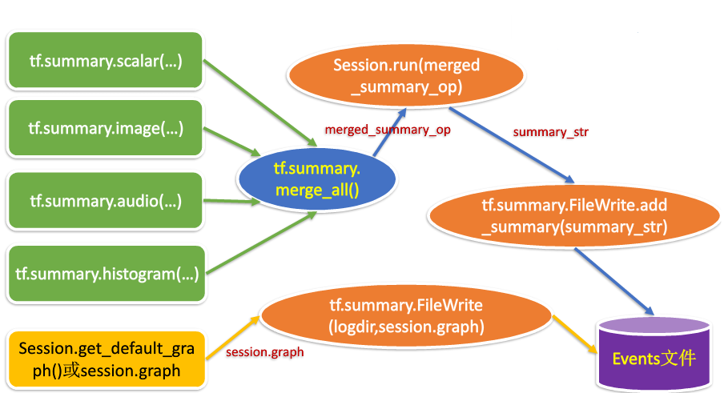

### 模型可视化

- 随着深度神经网络做的的发展，网络的结构越来越复杂，我们也很难确定每一层的输入结构，输出结构以及参数等信息，这样导致我们很难在短时间内完成debug。因此掌握一个可以用来可视化网络结构的工具是十分有必要的。类似的功能在另一个深度学习库Keras中可以调用一个叫做`model.summary()`的API来很方便地实现，调用后就会显示我们的模型参数，输入大小，输出大小，模型的整体参数等，但是在PyTorch中没有这样一种便利的工具帮助我们可视化我们的模型结构。

- 为了解决这个问题，人们开发了torchinfo工具包 ( torchinfo是由torchsummary和torchsummaryX重构出的库, torchsummary和torchsummaryX已经许久没更新了) 。本节我们将介绍如何使用torchinfo来可视化网络结构。
- 1.tensorboard可视化的用途
首要的目的是记录tensorflow的Graph，tensorflow的Graph其实就是具象化的算法模型；可以认为tensorflow用Graph来替代我们平时自己写的流程化的模型程序，具体区别就是我们自己写的程序需要自己进行流程化规范，而tensorflow的Graph设计好后，具体执行流程由tensorflow的Session控制，不需要我们人为去控制流程。

图的可视化效果可以参考：tensorflow图可视化

tensorboard还可以记录和查看模型的过程数据，例如迭代过程中的损失值，准确率，过程中的图片，学习速率等等过程数据；以前这些数据的可视化之前大多是由开发者自己在模型训练中记录数据然后使用matplotlib库图像化。

总的可以认为tensorboard可视化的用途：为了更方便 TensorFlow 程序的理解、调试与优化，发布了一套名为 TensorBoard 的可视化工具。您可以用 TensorBoard 来展现 TensorFlow 图，绘制图像生成的定量指标图以及显示附加数据（如其中传递的图像）。

2.tensorboard可视化的实现过程
tensorboard是一个用来画图的工具，但是自己不生产数据，它只是数据的搬运工。数据是来自于tensorflow模型的训练过程，所以可视化的过程按照时间顺序可以分为2个部分：

（1）使用tensorflow训练算法模型，生成tesorflow的Graph和过程数据，并保存到磁盘中的Events文件中去；

（2）使用tensorboard读取Graph和这些过程数据，并将它们绘制出来。

2.1 可视化过程图
具体的实现过程大致如下图所示：


2.2 如何生成Events文件
（1）创建tensorflow图；

　　tensorflow系统会自动维护一个默认的计算图，所以这里暂不用管；关于计算图管理可以参照该文章。

（2）在想要的节点下标注总结指令；例如记录标量：
```python
loss = tf.reduce_mean(loss_list)
tf.summary.scalar("loss_value",loss)
```
（3）将所有的想要的节点信息通过tf.summary.merge_all()打包为一个节点，这里命名为summary__merge_op，随后创建一个写入器，为后续的写入磁盘创建接口；
```python
summary_merge_op = tf.summary.merge_all()
writer = tf.summary.FileWriter("filedir",tf.get_default_graph())
```
其中“filedir”是保存Events文件的路径。

（4）在训练过程中运行打包后的节点,并获取序列化的节点信息；
```python

sess = tf.Session()
summary_info = sess.run(summary_merge_op)
```
（5）将序列化的节点信息写入磁盘中的Events文件，这个操作通过写入器writer实现；
```python
writer.add_summary(summary_info,step)
```
3.summary中常用对象和方法的详解
3.1 summary.op
常见的几个操作，scalar是用来记录标量信息，image用来记录图片信息，audio用来记录声音信息，histogram用来记录直方图，以前两个为例讲解。

（1）scalar

summary.scalar(
    name,
    tensor,
    collections=None
    family=None,
)
name:即你给此节点信息赋予的称呼，str类型，比如损失值可以为“loss_value”，准确率可以为“accuracy”等；无强制要求；

tensor:就是你需要记录的那个节点；用scalar记录的只能是标量（一个值的实数）；

collections：图的集合键值的可选列表，新的求和op被添加到这个集合中，缺省为[GraphKeys.SUMMARIES];

family：可选项；设置时用作求和标签名称的前缀，这影响着TensorBoard所显示的标签名;

真正用时一般使用前两个变量即可。

a = tf.Variable(0,tf.int32,name="a")
tf.summary.scalar("parameter",a)
（2）image

复制代码
tf.summary.image(
    name,
    tensor,
    max_outputs=3,
    collections=None,
    family=None
)
name:同上

tensor：这里的tensor必须是一个4维的张量，维度分布是[batch_zize, height, width, channels]，其中第四维度channels必须是1，3，或4中的一个；

max_output：图上显示的批次图片的最大个数；

 

 3.2 summary.merge_all()
作用是将所有的summary.op操作打包为一个节点，在Session中执行一次打包后的节点操作即等同于将所有的summary.op执行一次；merge_all()会主动寻找所有的summary_op操作。

此操作必须放在所有的summary.op后面。

 

3.3 summary.FileWriter()
创建一个写入器，可以通过写入器将数据信息写入到磁盘的Events文件中去，

```python

__init__(
    logdir,
    graph=None,
    max_queue=10,
    flush_secs=120,
    graph_def=None,
    filename_suffix=None,
    session=None
)
logdir：Events文件存放路径，用str表示；

graph：计算图对象，比如sess.graph；

max_queen：int类型；缓存队列的大小；

flush_secs：周期，int类型；指的是写入器将缓存数据写入磁盘的周期；

graph_def：此值已经弃用，不用管

filename_suffix:

session:

平时工作中，一般仅用前两个参数

...create a graph...
# Launch the graph in a session.
sess = tf.Session()
# Create a summary writer, add the 'graph' to the event file.
writer = tf.summary.FileWriter(<some-directory>, sess.graph)
 
```
3.4 writer.add_summary()
writer对象有很多中方法，这里只介绍其中的add_summary方法。
```python
add_summary(
    summary,
    global_step=None
)
```

summary：即执行记录操作后返回的序列化信息，例如summary_info；

global_step：迭代过程在事件上的标号，如果此参数不赋值，那么所有数据将会在一条直线上；
```python
for epoch in range(epochs):
    summary_info = sess.run(summary_merge_op)
    writer.add(summary_info,epoch)
```
add_summary操作并不会将节点信息立马写入磁盘，它只是先将节点信息放入写入器对象的缓存中，最终由写入器统一写入磁盘。
4.启用tensorboard
打开终端cmd；找到存放Events文件的文件夹路径；输入
tensorboard --logdir="./log"
其中“./log”是我存放文件的路径，你需要指定到自己的路径上去。
如果前面的都没问题，那么会出现以下的内容：
将途中红圈框主的内容复制下来，然后在浏览器中打开即可：

 5.简单的示例
```python
import tensorflow as tf

x = tf.compat.v1.Variable(-5.0,"float",name="x")
y = tf.multiply(x,x)

#将节点信息加入summary
tf.summary.scalar("x_label",x)
tf.summary.scalar("pingfang",y)

#合并summary.op
summary_merge_op = tf.summary.merge_all()

#开始绘会话
with tf.Session() as sess:
    init = tf.global_variables_initializer()
    #创建写入器
    writer = tf.summary.FileWriter("./log",sess.graph)
    #变量初始化
    sess.run(init)

    for epoch in range(11):
        summary_info = sess.run(summary_merge_op)
        writer.add_summary(summary_info,epoch)

        #给变量x加1
        temp = sess.run(tf.add(x,1.0))
        sess.run(tf.assign(x,temp))

```
