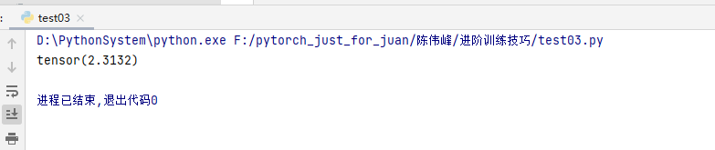
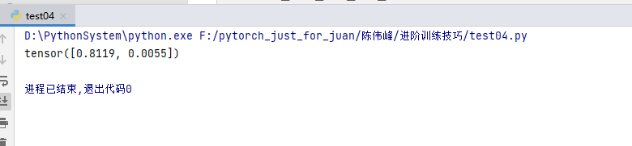
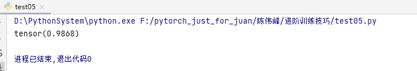
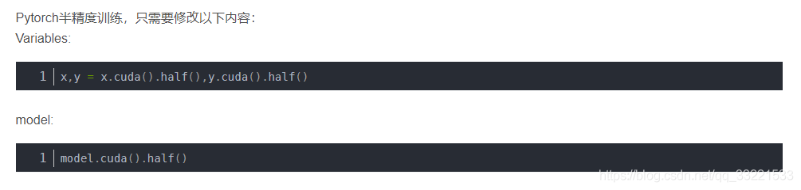

### 如何自定义损失函数

#### 函数方式定义

```python
import numpy as np
import torch

def MSE(target,output):
    if not isinstance(target,torch.Tensor)  or not isinstance(output,torch.Tensor):
        target = torch.tensor(target)
        output = torch.tensor(output)
    return ((output-target)**2).sum().mean()


if __name__ == '__main__':
    target = torch.randn(20)
    output = torch.randn(20)
    print(MSE(target,output))
```

#### 类方式定义

$$ DSC = \frac{2|X∩Y|}{|X|+|Y|} $$

```python
import torch
from torch import nn

class DiceLoss(nn.Module):
    def __init__(self, weight=None, size_average=True):
        super(DiceLoss, self).__init__()

    def forward(self, inputs, targets, smooth=1):
        inputs = torch.sigmoid(inputs)
        inputs = inputs.view(-1)
        targets = targets.view(-1)
        intersection = (inputs * targets).sum()
        dice = (2. * intersection + smooth) / (inputs.sum() + targets.sum() + smooth)
        return 1 - dice


if __name__ == '__main__':
    inputs = torch.ones(224,224)
    targets = torch.zeros(224,224)
    # 使用方法
    criterion = DiceLoss()
    loss = criterion(inputs, targets)
    print(loss)
```

除此之外，常见的损失函数还有BCE-Dice Loss，Jaccard/Intersection over Union (IoU) Loss，Focal Loss......


```
import torch
from torch import nn
import torch.nn.functional as F
class DiceBCELoss(nn.Module):
    def __init__(self, weight=None, size_average=True):
        super(DiceBCELoss, self).__init__()

    def forward(self, inputs, targets, smooth=1):
        inputs = torch.sigmoid(inputs)
        inputs = inputs.view(-1)
        targets = targets.view(-1)
        intersection = (inputs * targets).sum()
        dice_loss = 1 - (2. * intersection + smooth) / (inputs.sum() + targets.sum() + smooth)
        BCE = F.binary_cross_entropy(inputs, targets, reduction='mean')
        Dice_BCE = BCE + dice_loss

        return Dice_BCE

if __name__ == '__main__':
    inputs = torch.ones(224,224)
    targets = torch.zeros(224,224)
    # 使用方法
    criterion = DiceBCELoss()
    loss = criterion(inputs, targets)
    print(loss)
```



IOU_Loss

```python
import torch
from torch import nn
import torch.nn.functional as F
import numpy as np

class IoULoss(nn.Module):
    def __init__(self, weight=None, size_average=True):
        super(IoULoss, self).__init__()

    def forward(self, inputs, targets, smooth=1,isMin=False):
        '''

        :param inputs: box
        :param targets: boxes
        :param smooth: 1
        :param isMin: False
        :return:
        '''
        inputs_area = (inputs[3] - inputs[1]) * (inputs[2] - inputs[0])
        targets_area = (targets[:, 3] - targets[:, 1]) * (targets[:, 2] - targets[:, 0])

        xx1 = torch.maximum(inputs[0], targets[:, 0])
        yy1 = torch.maximum(inputs[1], targets[:, 1])
        xx2 = torch.minimum(inputs[2], targets[:, 2])
        yy2 = torch.minimum(inputs[3], targets[:, 3])

        w = torch.maximum(torch.zeros(1), (xx2 - xx1))
        h = torch.maximum(torch.zeros(1), (yy2 - yy1))

        area = w * h

        if isMin:
            return torch.true_divide(area+smooth, torch.minimum(inputs_area, targets_area)+smooth)
        else:
            return torch.true_divide(area+smooth, inputs_area + targets_area - area+smooth)

if __name__ == '__main__':
    loss= IoULoss()
    a = torch.tensor([1, 1, 11, 11])
    bs = torch.tensor([[1, 1, 10, 10], [11, 11, 20, 20]])
    print(loss(a, bs))

```



Focal_loss

```python
import torch
from torch import nn
import torch.nn.functional as F
import numpy as np

class FocalLoss(nn.Module):
    def __init__(self, weight=None, size_average=True):
        super(FocalLoss, self).__init__()

    def forward(self, inputs, targets, alpha=0.8, gamma=0.2, smooth=1):
        inputs = torch.sigmoid(inputs)
        inputs = inputs.view(-1)
        targets = targets.view(-1)
        BCE = F.binary_cross_entropy(inputs, targets, reduction='mean')
        BCE_EXP = torch.exp(-BCE)
        focal_loss = alpha * (1 - BCE_EXP) ** gamma * BCE

        return focal_loss


if __name__ == '__main__':
    inputs = torch.ones(224, 224)
    targets = torch.zeros(224, 224)
    # 使用方法
    criterion = FocalLoss()
    loss = criterion(inputs, targets)
    print(loss)
```




## 6.2 动态调整学习率

学习率的选择是深度学习中一个困扰人们许久的问题，学习速率设置过小，会极大降低收敛速度，增加训练时间；学习率太大，可能导致参数在最优解两侧来回振荡。但是当我们选定了一个合适的学习率后，经过许多轮的训练后，可能会出现准确率震荡或loss不再下降等情况，说明当前学习率已不能满足模型调优的需求。此时我们就可以通过一个适当的学习率衰减策略来改善这种现象，提高我们的精度。这种设置方式在PyTorch中被称为scheduler，也是我们本节所研究的对象。

经过本节的学习，你将收获：

- 如何根据需要选取已有的学习率调整策略
- 如何自定义设置学习调整策略并实现

### 6.2.1 使用官方scheduler

- **了解官方提供的API**

在训练神经网络的过程中，学习率是最重要的超参数之一，作为当前较为流行的深度学习框架，PyTorch已经在`torch.optim.lr_scheduler`为我们封装好了一些动态调整学习率的方法供我们使用，如下面列出的这些scheduler。

- [`lr_scheduler.LambdaLR`](https://pytorch.org/docs/stable/generated/torch.optim.lr_scheduler.LambdaLR.html#torch.optim.lr_scheduler.LambdaLR)
- [`lr_scheduler.MultiplicativeLR`](https://pytorch.org/docs/stable/generated/torch.optim.lr_scheduler.MultiplicativeLR.html#torch.optim.lr_scheduler.MultiplicativeLR)
- [`lr_scheduler.StepLR`](https://pytorch.org/docs/stable/generated/torch.optim.lr_scheduler.StepLR.html#torch.optim.lr_scheduler.StepLR)
- [`lr_scheduler.MultiStepLR`](https://pytorch.org/docs/stable/generated/torch.optim.lr_scheduler.MultiStepLR.html#torch.optim.lr_scheduler.MultiStepLR)
- [`lr_scheduler.ExponentialLR`](https://pytorch.org/docs/stable/generated/torch.optim.lr_scheduler.ExponentialLR.html#torch.optim.lr_scheduler.ExponentialLR)
- [`lr_scheduler.CosineAnnealingLR`](https://pytorch.org/docs/stable/generated/torch.optim.lr_scheduler.CosineAnnealingLR.html#torch.optim.lr_scheduler.CosineAnnealingLR)
- [`lr_scheduler.ReduceLROnPlateau`](https://pytorch.org/docs/stable/generated/torch.optim.lr_scheduler.ReduceLROnPlateau.html#torch.optim.lr_scheduler.ReduceLROnPlateau)
- [`lr_scheduler.CyclicLR`](https://pytorch.org/docs/stable/generated/torch.optim.lr_scheduler.CyclicLR.html#torch.optim.lr_scheduler.CyclicLR)
- [`lr_scheduler.OneCycleLR`](https://pytorch.org/docs/stable/generated/torch.optim.lr_scheduler.OneCycleLR.html#torch.optim.lr_scheduler.OneCycleLR)
- [`lr_scheduler.CosineAnnealingWarmRestarts`](https://pytorch.org/docs/stable/generated/torch.optim.lr_scheduler.CosineAnnealingWarmRestarts.html#torch.optim.lr_scheduler.CosineAnnealingWarmRestarts)

- **使用官方API**

关于如何使用这些动态调整学习率的策略，`PyTorch`官方也很人性化的给出了使用实例代码帮助大家理解，我们也将结合官方给出的代码来进行解释。

```
# 选择一种优化器
optimizer = torch.optim.Adam(...) 
# 选择上面提到的一种或多种动态调整学习率的方法
scheduler1 = torch.optim.lr_scheduler.... 
scheduler2 = torch.optim.lr_scheduler....
...
schedulern = torch.optim.lr_scheduler....
# 进行训练
for epoch in range(100):
    train(...)
    validate(...)
    optimizer.step()
    # 需要在优化器参数更新之后再动态调整学习率
	scheduler1.step() 
	...
    schedulern.step()
```

**注**：

我们在使用官方给出的`torch.optim.lr_scheduler`时，需要将`scheduler.step()`放在`optimizer.step()`后面进行使用。

### 自定义scheduler

虽然PyTorch官方给我们提供了许多的API，但是在实验中也有可能碰到需要我们自己定义学习率调整策略的情况，而我们的方法是自定义函数`adjust_learning_rate`来改变`param_group`中`lr`的值，在下面的叙述中会给出一个简单的实现。

假设我们现在正在做实验，需要学习率每30轮下降为原来的1/10，假设已有的官方API中没有符合我们需求的，那就需要自定义函数来实现学习率的改变。

```
def adjust_learning_rate(optimizer, epoch):
    lr = args.lr * (0.1 ** (epoch // 30))
    for param_group in optimizer.param_groups:
        param_group['lr'] = lr
```

有了`adjust_learning_rate`函数的定义，在训练的过程就可以调用我们的函数来实现学习率的动态变化

```
def adjust_learning_rate(optimizer,...):
    ...
optimizer = torch.optim.SGD(model.parameters(),lr = args.lr,momentum = 0.9)
for epoch in range(10):
    train(...)
    validate(...)
    adjust_learning_rate(optimizer,epoch)
```


### 模型的微调

应用迁移学习(transfer learning)，将从源数据集学到的知识迁移到目标数据集上。例如，虽然ImageNet数据集的图像大多跟椅子无关，但在该数据集上训练的模型可以抽取较通用的图像特征，从而能够帮助识别边缘、纹理、形状和物体组成等。这些类似的特征对于识别椅子也可能同样有效。


1. 在源数据集(如ImageNet数据集)上预训练一个神经网络模型，即源模型。
2. 创建一个新的神经网络模型，即目标模型。它复制了源模型上除了输出层外的所有模型设计及其参数。我们假设这些模型参数包含了源数据集上学习到的知识，且这些知识同样适用于目标数据集。我们还假设源模型的输出层跟源数据集的标签紧密相关，因此在目标模型中不予采用。
3. 为目标模型添加一个输出⼤小为⽬标数据集类别个数的输出层，并随机初始化该层的模型参数。
4. 在目标数据集上训练目标模型。我们将从头训练输出层，而其余层的参数都是基于源模型的参数微调得到的。

常用网络汇总

```python

import torchvision.models as models
resnet18 = models.resnet18()
# resnet18 = models.resnet18(pretrained=False)  等价于与上面的表达式
alexnet = models.alexnet()
vgg16 = models.vgg16()
squeezenet = models.squeezenet1_0()
densenet = models.densenet161()
inception = models.inception_v3()
googlenet = models.googlenet()
shufflenet = models.shufflenet_v2_x1_0()
mobilenet_v2 = models.mobilenet_v2()
mobilenet_v3_large = models.mobilenet_v3_large()
mobilenet_v3_small = models.mobilenet_v3_small()
resnext50_32x4d = models.resnext50_32x4d()
wide_resnet50_2 = models.wide_resnet50_2()
mnasnet = models.mnasnet1_0()

```

```
1. 通常PyTorch模型的扩展为`.pt`或`.pth`，程序运行时会首先检查默认路径中是否有已经下载的模型权重，一旦权重被下载，下次加载就不需要下载了。

2. 一般情况下预训练模型的下载会比较慢，我们可以直接通过迅雷或者其他方式去 [这里](https://github.com/pytorch/vision/tree/master/torchvision/models) 查看自己的模型里面`model_urls`，然后手动下载，预训练模型的权重在`Linux`和`Mac`的默认下载路径是用户根目录下的`.cache`文件夹。在`Windows`下就是`C:\Users\<username>\.cache\torch\hub\checkpoint`。我们可以通过使用 [`torch.utils.model_zoo.load_url()`](https://pytorch.org/docs/stable/model_zoo.html#torch.utils.model_zoo.load_url)设置权重的下载地址。

3. 如果觉得麻烦，还可以将自己的权重下载下来放到同文件夹下，然后再将参数加载网络。
```

加载预训练

```python
self.model = models.resnet50(pretrained=False)
self.model.load_state_dict(torch.load('./model/resnet50-19c8e357.pth'))
```


针对某一层的训练:

```
def set_parameter_requires_grad(model, feature_extracting):
    if feature_extracting:
        for param in model.parameters():
            param.requires_grad = False
```


只修改输出层

```python
import torchvision.models as models
# 冻结参数的梯度
feature_extract = True
model = models.resnet18(pretrained=True)
set_parameter_requires_grad(model, feature_extract)
# 修改模型
num_ftrs = model.fc.in_features
model.fc = nn.Linear(in_features=512, out_features=4, bias=True)
```


#### 半精度训练

我们观察PyTorch默认的浮点数存储方式用的是torch.float32，小数点后位数更多固然能保证数据的精确性，但绝大多数场景其实并不需要这么精确，只保留一半的信息也不会影响结果，也就是使用torch.float16格式。由于数位减了一半，因此被称为“半精度”

```python
from torch.cuda.amp import autocast
```

```
@autocast()   
def forward(self, x):
    ...
    return x
```

```
 for x in train_loader:
	x = x.cuda()
	with autocast():
        output = model(x)
        ...
```

还有个很简单的方法,气不气~

